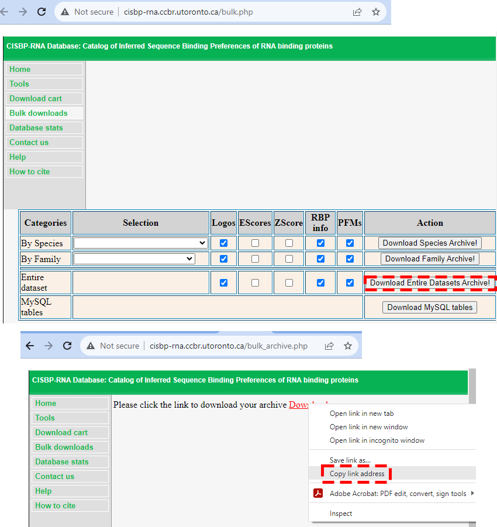

# Furna: a structural database for FUnctions of RNA #

### 0. configure binary executables ##
```bash
cd script
make
cd cdhit_src/
make
make install
```

Optionally, to show directed acylic graph for Gene Ontology terms on the website, the ``dot`` program from [Graphviz](https://graphviz.org/) can be used. If your system does not have Graphviz, you can install it to ``graphviz/bin/dot`` from source code:
```bash
wget https://gitlab.com/api/v4/projects/4207231/packages/generic/graphviz-releases/6.0.2/graphviz-6.0.2.tar.gz
tar -xvf graphviz-6.0.2.tar.gz
cd graphviz-6.0.2/
mkdir ../graphviz
./configure --prefix=`readlink -e ../graphviz`
make
make install
cd ..
rm -rf graphviz-6.0.2.tar.gz graphviz-6.0.2
```

### 1. Get cisbp-RNA download link ###
Go to [http://cisbp-rna.ccbr.utoronto.ca/bulk.php](http://cisbp-rna.ccbr.utoronto.ca/bulk.php),
click "Download Entire Datasets Archive", which will open
[http://cisbp-rna.ccbr.utoronto.ca/bulk_archive.php](http://cisbp-rna.ccbr.utoronto.ca/bulk_archive.php). Right click on "Download" and Copy link address.
Paste the url link to 
```perl
my $url="http://cisbp-rna.ccbr.utoronto.ca/tmp/entiredata_2023_09_25_9:33_am.zip";
```
at the top of ``script/download_cisbp.pl``.


### 2. Download raw data ###
```bash
script/download_pdb.pl
script/download_rfam.pl
script/download_rnacentral.pl
script/download_goa.pl
script/download_sifts.pl
```

### 3. Curate data ###
```bash
script/curate_pdb.pl
script/curate_rfam.pl
script/curate_rnacentral.pl
script/curate_goa.pl
script/combine_chain.pl
```

### 4. Download data for each rna entry ###
```bash
script/download_pubmed.pl
script/download_assembly.pl
script/combine_interaction.pl
script/download_ligand.pl
script/combine_protein.pl
script/download_taxon.pl
script/fasta2taxon.pl
script/plot_goa.pl
script/make_summary.pl
script/combine_dna.pl
script/curate_blastdb.pl
script/download_uniprot.pl
script/download_attract.pl
script/download_cisbp.pl
```
